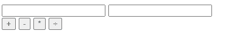

# 任务二

完成简单计算器应用

## 说明

- 第一行 显示两个输入框（\<input\>元素）以允许用户输入数字
- 第二行 显示四个按钮（\<button\>元素），使用 JavaScript 分别给这四个 \<button\> 元素实现 加、减、乘、除 的功能
- 第三行 显示计算的结果

## 示例

## 拓展

- 检测到不合法的计算（如：除数为零）后弹窗报错（使用 JavaScript 调用 alert()函数）
- 保存每次计算的历史记录并显示（数字、计算类型、计算结果）
- 通过编写简单样式美化输入框和按钮
